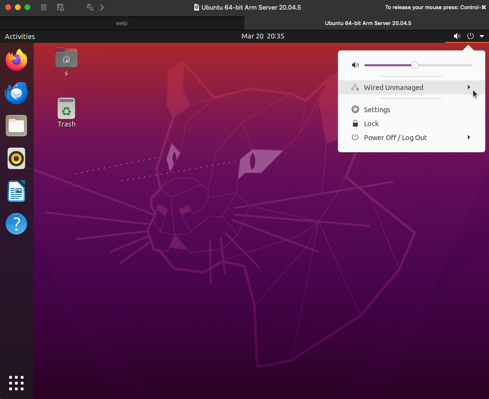
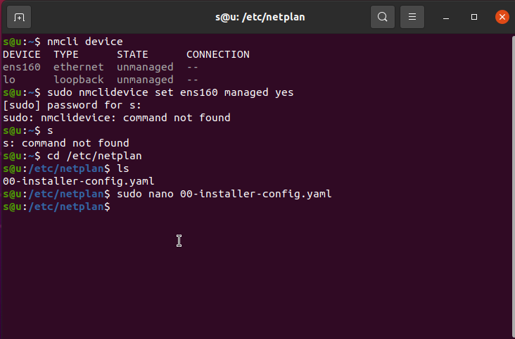
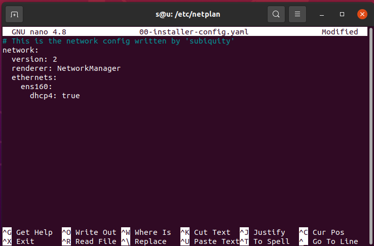
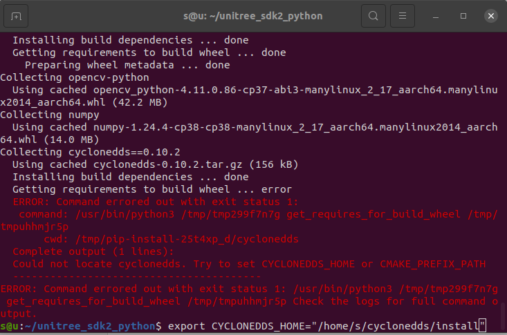
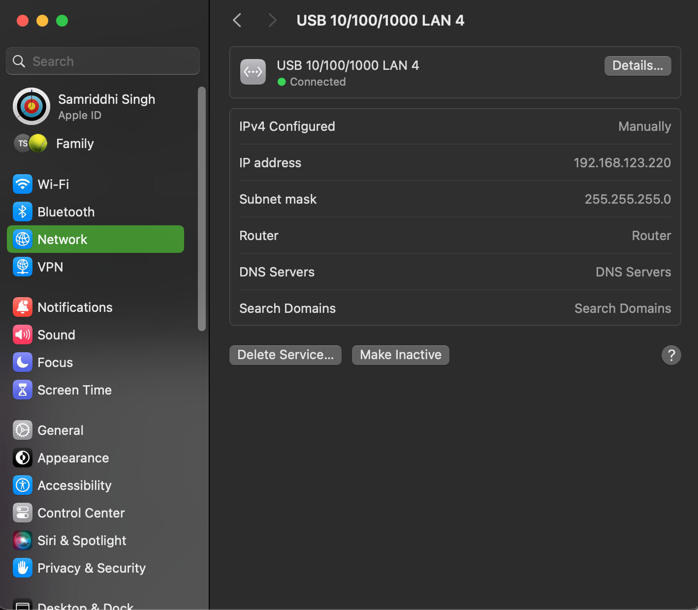
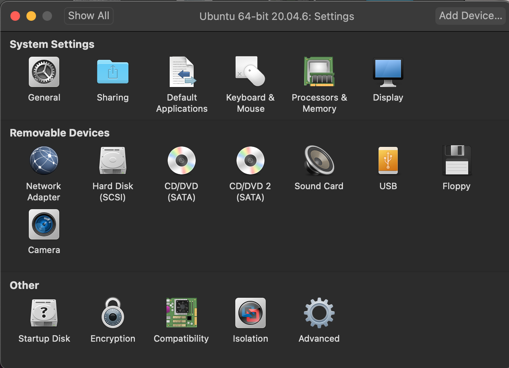

# Hackathon at LIMES

Welcome to the GirlsCanCode x LIMES Hackathon! Follow the steps below to set up your environment and get started. 

## Overview

- **Operating System**: Ubuntu 20.04
- **Required Software**: VMware Fusion (for Apple users) or VMware Workstation Pro (for Windows users)
- **Additional SDK**: unitree_sdk2py

### Step 1: Download VMware

#### For Apple Users (VMware Fusion):
- Download VMware Fusion:  
  [VMware Fusion 13 for Apple](https://support.broadcom.com/group/ecx/productfiles?subFamily=VMware%20Fusion&displayGroup=VMware%20Fusion%2013&release=13.6.3&os=&servicePk=&language=EN&freeDownloads=true)

#### For Windows Users (VMware Workstation Pro):
- Download VMware Workstation Pro:  
  [VMware Workstation Pro 17.0 for Windows](https://support.broadcom.com/group/ecx/productfiles?subFamily=VMware%20Workstation%20Pro&displayGroup=VMware%20Workstation%20Pro%2017.0%20for%20Windows&release=17.6.3&os=&servicePk=&language=EN&freeDownloads=true)

Click the download link and follow the installation instructions on screen.

### Step 2: Ubuntu 20.04 Setup

#### Check Your Processor

Before downloading the Ubuntu image, check the processor type on your computer:

##### For Windows:
1. Open Task Manager:
   - Press `Ctrl + Shift + Esc` or right-click on the taskbar and select **Task Manager**.
2. Go to the **Performance** tab.
3. Check the **CPU** details:
   - The CPU model will tell you if it’s an AMD, Intel, or ARM processor.

##### For Mac:
1. Click the Apple logo in the top-left corner.
2. Select **About This Mac**.
3. Check the **Chip** or **Processor** section:
   - If it says Apple M1, M2, or later, you're using an ARM-based Apple Silicon chip.
   - If it lists Intel, you're using an Intel processor.

#### Download the Correct Ubuntu Image:

##### For **AMD** or **Intel**:
- **Desktop Image**: [Download Ubuntu 20.04](https://releases.ubuntu.com/focal/)

##### For **ARM**:
- **Server Image**: [Download Ubuntu Server 20.04](https://cdimage.ubuntu.com/releases/20.04.3/release/)

### Step 3: VMware Setup

#### Create a Virtual Machine in VMware

1. Open VMware and click on **Create a New Virtual Machine**.Or simply drag the iso file in VMware.+
4. Name your VM and choose the location on your computer.
5. Assign  **20GB** of disk space (less is fine aswell).
6. Complete the VMware installation steps.

## For ARM-based Systems ONLY !!!!(Additional Setup):

1. Log in via terminal (using the username and password provided earlier).
2. Run the following commands to update and install the desktop version:

    ```bash
    sudo apt update
    sudo apt upgrade
    sudo apt install ubuntu-desktop
    sudo reboot
    ```

    After rebooting, Ubuntu should download the desktop version.

3. Check if networks are unmanaged by going to the top-right of the screen. If yes, run the following:
  
  
    ```bash
    ifconfig
    ```

    Set the interface to be managed by changing <interface-name> with a network out putted by ifconfig:

    ```bash
    sudo nmcli device set <interface-name> managed yes
    ```

4. Next, navigate to the network settings:

    ```bash
    cd /etc/netplan
    ```

    - If the file is not named `01-netcfg.yaml`, enter another name in its place and edit the file:

    ```bash
    sudo nano /etc/netplan/01-netcfg.yaml
    ```

    - In the Nano editor, replace the content with:
    

    ```yaml
    network:
      version: 2
      renderer: NetworkManager
      ethernets:
        eth0:
          dhcp4: true
    ```

    - Save the file by pressing `Ctrl + X`, then `Y`, and hit `Enter`.

5. Restart VMware and check if networks are managed.

## Step 4: Install unitree_sdk2py

For all users:

1. Install `unitree_sdk2py`:

    ```bash
    pip install unitree_sdk2py
    sudo apt install python3-pip
    sudo apt install git
    sudo apt install net-tools
    ```


2. Clone the unitree_sdk2_python repository and install it:

    ```bash
    git clone https://github.com/unitreerobotics/unitree_sdk2_python.git
    cd unitree_sdk2_python
    pip3 install -e .
    ```

#### Fixing pip3 Installation Error

If you encounter the following error:




  ```Could not locate cyclonedds. Try to set CYCLONEDDS_HOME or CMAKE_PREFIX_PATH  ```


Run these commands:

1. Clone Cyclone DDS:

    ```bash
    cd ~
    git clone https://github.com/eclipse-cyclonedds/cyclonedds -b releases/0.10.x
    cd cyclonedds && mkdir build install && cd build
    cmake .. -DCMAKE_INSTALL_PREFIX=../install
    cmake --build . --target install
    ```

2. Set `CYCLONEDDS_HOME` to the path where Cyclone DDS was installed:

    ```bash
    cd ~/unitree_sdk2_python
    export CYCLONEDDS_HOME="~/cyclonedds/install"
    pip3 install -e .
    ```

## Step 5: Test to See If It Works

### For macOS:
1. Change the USB-C to Ethernet adapter's IP address to `192.168.123.XXX` (any value except `18`, which is reserved for the robot).

2. Configure USB  
Go to **VM Settings** > **USB** and set USB to **3.1**.  
   
3. Click on **Send to VM**.
4. add a new network adaptor in vm settings

   
7. In the VM, change the IP address again.
   
   
9. Run the following command to check network connections:
   ```bash
    ifconfig
    ```
5.Identify the connection with 192.168.123.XXX this is the one you want to connect to.


# Setting Up the VM for Windows  

1: Configure USB  
Go to **VM Settings** > **USB** and set USB to **3.1**.  

2: Connect to the VM  
Send the connection to the VM.  

3: Configure Network  

In the VM, set the network connection to `192.168.123.XXX`  
(Choose any value except `18`, which is reserved for the robot).  


# Step 6: Testing the Setup  
Test the setup using the following command.Change ens37 with the network name output ifconfig 192.168.123.XXX  If everything is configured correctly, the robot should sit down:  


python3 /unitree_sdk2_python/example/go2/high_level/go2_sport_client.py ens37


